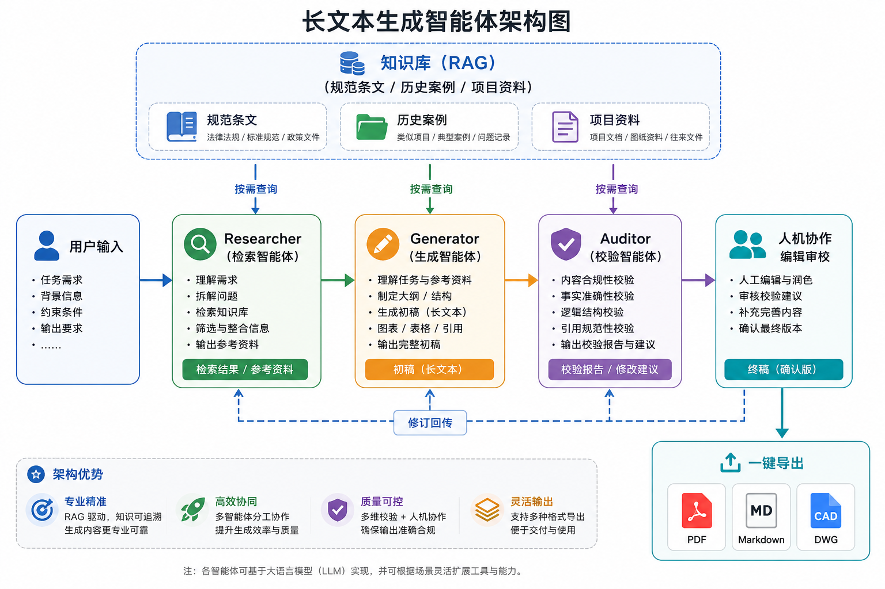
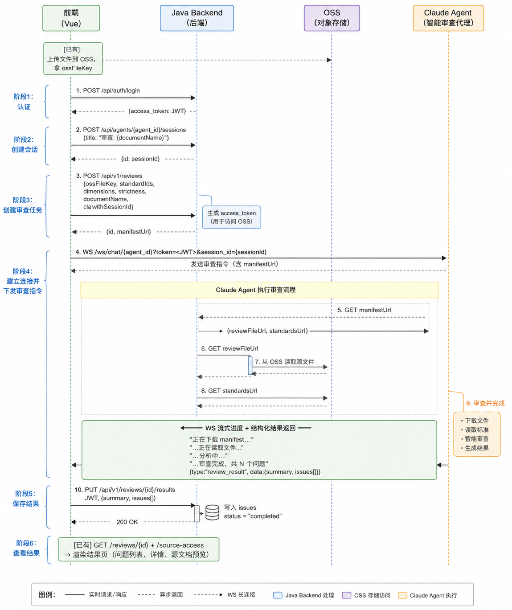

<h1 align="center">OpenSpec</h1>

<p align="center">
  <strong>Enterprise-Grade AI Platform for Long-Document Generation & Intelligent Review</strong>
</p>

<p align="center">
  Unify long-document generation and agent-driven intelligent review — from days to minutes.
</p>

<p align="center">
  <a href="./README.md">中文</a> |
  <a href="./README_en.md">English</a>
</p>

<p align="center">
  <a href="https://github.com/zhuzhaoyun/OpenSpec/releases/latest"></a>
  <a href="https://github.com/zhuzhaoyun/OpenSpec/blob/main/LICENSE"></a>
  <a href="https://github.com/zhuzhaoyun/OpenSpec"></a>
  <a href="https://github.com/zhuzhaoyun/OpenSpec/fork"></a>
  <a href="https://github.com/zhuzhaoyun/OpenSpec/pulls"></a>
</p>

<p align="center">
  <a href="https://archspec.aizzyun.com/">Live Demo</a> &bull;
  <a href="https://www.bilibili.com/video/BV1DoFUzBEmW/">Video Introduction</a> &bull;
  <a href="#quick-start">Quick Start</a> &bull;
  <a href="#contact-us">Contact Us</a>
</p>

---

## Why OpenSpec?

Generic AI (ChatGPT, Claude, Qwen, etc.) falls short on professional long documents:

| Problem | Generic AI | OpenSpec |
|---------|:----------:|:--------:|
| Documents over 50 pages | Context lost, inconsistencies | Chapter-by-chapter generation, fully coherent |
| Industry standards & regulations | Hallucination, makes things up | RAG retrieval from your own knowledge base |
| Document formatting & templates | Cannot control layout | PDF / Markdown / AutoCAD export |
| Quality assurance | Single-pass, no review | Three-agent workflow (Researcher + Generator + Auditor) |
| Regulation compliance review | Manual cross-check, easy to miss items | Agent-driven intelligent review module, clause-by-clause validation |

**OpenSpec is not another AI writing tool.** It is a document engineering platform that unifies long-document generation and intelligent review, built for professionals who need accuracy, compliance, and scale.

## How It Works

### Long-Document Generation — Three-Agent Workflow



The system is powered by a **three-agent workflow**, where each agent can autonomously query the knowledge base when it needs more context:

1. **Researcher Agent** — Gathers relevant standards, historical cases, and reference materials from the knowledge base to build a solid research foundation
2. **Generator Agent** — Produces standards-compliant professional content chapter by chapter, based on the research context
3. **Auditor Agent** — Reviews the generated content for compliance, consistency, and accuracy; queries the knowledge base for cross-validation and sends revisions back to the Generator if needed
4. **Human-AI Collaboration** — Review, rewrite, and refine at the chapter level
5. **One-Click Export** — PDF, Markdown, AutoCAD title blocks, and more

### Intelligent Review — Agent-Driven Standalone Review Module



The **Review Module** is an **agent-centric standalone subsystem** with broad domain adaptability, not limited to any specific industry:

- **Clause Entry & Management** — Structured entry of regulations, standards, contracts, or any review criteria
- **Agent-Powered Clause-by-Clause Review** — The intelligent agent automatically compares clauses against document content, analyzing compliance item by item
- **Auto-Flagging of Non-Compliant Items** — Precisely locates issues, generates review comments and revision suggestions
- **Multi-Domain Adaptation** — Adapts to architecture, healthcare, legal, finance, and more through configuration
- **Review Report Export** — One-click generation of annotated review reports, supporting traceability and archiving

## Use Cases

| Domain | Typical Documents |
|--------|-------------------|
| Architecture Design | Construction drawing design notes, feasibility study reports, design standard review |
| Automotive Repair | Repair technical manuals, fault diagnosis reports |
| Healthcare | Clinical trial reports, diagnosis & treatment standard documents, compliance review |
| Legal & Finance | Contract review, compliance reports, policy clause verification |
| Bidding & Tendering | Technical proposals, tender document preparation, compliance review |
| **Any Industry** | **Any structured long document from a knowledge base, plus intelligent clause-by-clause review** |

## UI Showcase

<table style="border-collapse: collapse; border: 1px solid black;">
  <tr>
    <td style="padding: 5px;background-color:#fff;"></td>
    <td style="padding: 5px;background-color:#fff;"></td>
  </tr>
  <tr>
    <td style="padding: 5px;background-color:#fff;"></td>
    <td style="padding: 5px;background-color:#fff;"></td>
  </tr>
</table>

> **Video Demo (Architecture Design Scenario):** [Watch on Bilibili](https://www.bilibili.com/video/BV1DoFUzBEmW/?share_source=copy_web&vd_source=d91cce476d06006159a799f4db6b9171)

## Live Demo

Try OpenSpec online: **[https://archspec.aizzyun.com/](https://archspec.aizzyun.com/)**

- Email: `test@qq.com`
- Password: `test123456`

## Tech Stack

| Layer | Technology |
|-------|-----------|
| Frontend | Vue 3, TypeScript, Vite |
| Backend | Spring Boot 3, Java 17 |
| AI Agent | Python, LangGraph, LangChain |
| Knowledge Retrieval | RAGFlow |
| Observability | Langfuse (LLM tracing & cost analytics) |
| Database | PostgreSQL |
| Deployment | Docker, Docker Compose |

## Quick Start

### Requirements

| Component | Version |
|-----------|---------|
| Docker | >= 20.10 |
| Docker Compose | >= 2.0 |

### One-Click Deployment

```bash
# 1. Clone the repository
git clone https://github.com/zhuzhaoyun/OpenSpec.git
cd OpenSpec

# 2. Copy and edit environment variables
cp deploy/docker/.env.example deploy/docker/.env
# Edit .env and fill in required configurations (RAGFlow, LLM API Key, etc.)

# 3. Start all services
cd deploy/docker
docker compose up -d
```

Once started, visit `http://localhost` to use the platform.

### Environment Variables

| Variable | Description | Required |
|----------|-------------|----------|
| `RAGFLOW_API_KEY` | RAGFlow API key | Yes |
| `RAGFLOW_BASE_URL` | RAGFlow service URL | Yes |
| `DASHSCOPE_API_KEY` | LLM API key (default: Qwen) | Yes |
| `LANGFUSE_SECRET_KEY` | Langfuse secret key (Prompt management) | No |
| `LANGFUSE_PUBLIC_KEY` | Langfuse public key | No |
| `LANGFUSE_BASE_URL` | Langfuse service URL | No |

For the full list of environment variables, see [`deploy/docker/.env.example`](deploy/docker/.env.example).

### Local Development

<details>
<summary>Expand to view local development guide</summary>

#### Frontend

```bash
cd apps/web
npm install
npm run dev
# Visit http://localhost:5173
```

#### AI Agent

```bash
cd apps/agent
pip install -r requirements.txt
cp ../../deploy/docker/.env.example .env
# Edit .env and fill in required configurations
uvicorn app:app --reload --port 5000 --host 0.0.0.0
```

#### Backend

```bash
cd apps/backend
mvn spring-boot:run
```

</details>

## Customization & Cooperation

For enterprise customization, feature extensions, deployment support, or professional training services, please feel free to contact us.

## Contributing

We welcome contributions! Feel free to:

- Star this project to show your support
- Submit [Issues](https://github.com/zhuzhaoyun/OpenSpec/issues) for bug reports and feature requests
- Open [Pull Requests](https://github.com/zhuzhaoyun/OpenSpec/pulls) for improvements

## Star History

<a href="https://star-history.com/#zhuzhaoyun/OpenSpec&Date">
 <picture>
   <source media="(prefers-color-scheme: dark)" srcset="https://api.star-history.com/svg?repos=zhuzhaoyun/OpenSpec&type=Date&theme=dark" />
   <source media="(prefers-color-scheme: light)" srcset="https://api.star-history.com/svg?repos=zhuzhaoyun/OpenSpec&type=Date" />
   
 </picture>
</a>

## Contact Us

For enterprise edition details or business cooperation, feel free to reach out:

- Email: `dlutyaol@qq.com`
- WeChat: Scan the QR code below

  

## License

Copyright (c) 2024-2026 OpenSpec Contributors.

Licensed under [The GNU General Public License v3.0 (GPLv3)](https://www.gnu.org/licenses/gpl-3.0.html).
